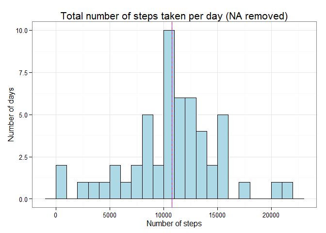
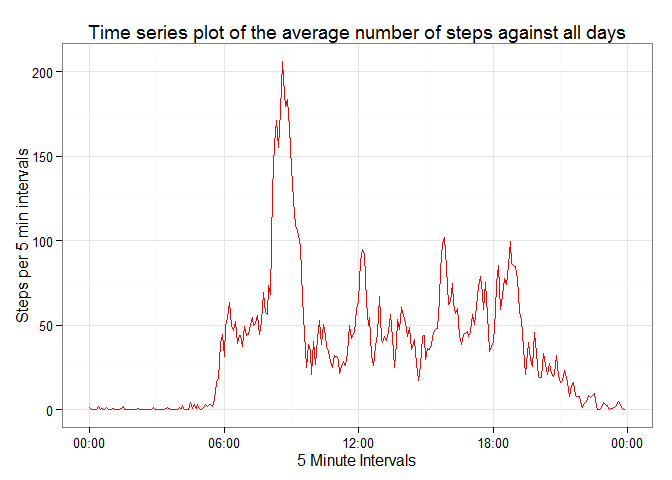
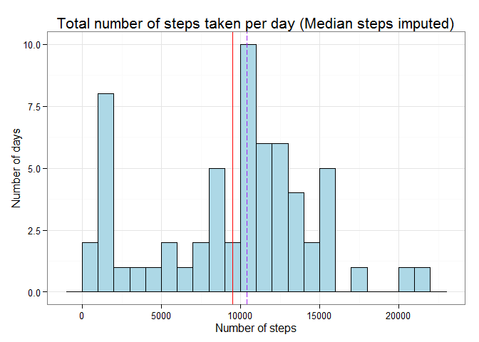
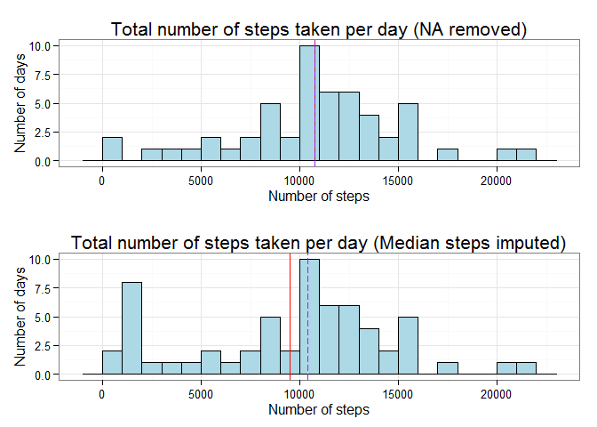
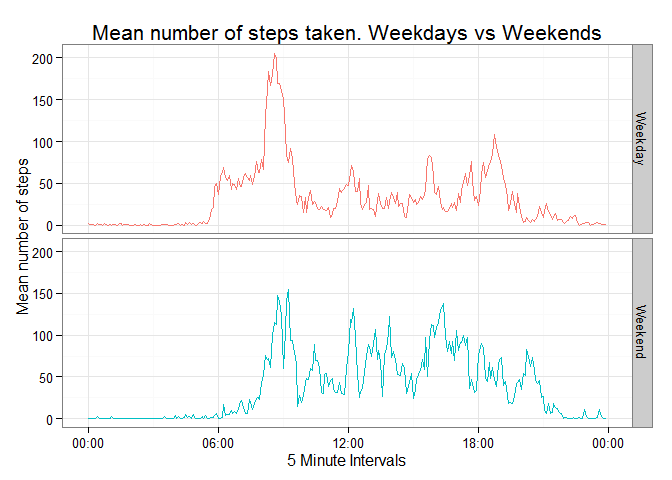

Reproducible Research - Assignment 1
====================================

By Long Huynh
-------------

###### 19/12/2015

------------------------------------------------------------------------

The purpose of this assignment is to demonstrate my ability to analyse
data and present my findings using R Markdown and Knitr. I will be using
a
[dataset](https://d396qusza40orc.cloudfront.net/repdata%2Fdata%2Factivity.zip)
that was taken from an anonymous individual between October 2012 to
November 2012, containing 3 variables:

-   **Steps**: Number of steps taken in a 5-minute interval.
-   **Date**: The date of which the measurement was taken in YYYY-MM-DD
    format.
-   **Interval**: Identifier for the the 5-minute interval in which
    measurement was taken.

This document presents both the R Code and the results from my findings.

Settings
--------

One of the requirements for this assignment is to show all the code and
the outputs. Therefore I set the entire code chunks in the document as
`echo = TRUE`.

    library(knitr)
    opts_chunk$set(echo = TRUE)

Loading libraries
-----------------

To support my analysis I initially loaded 3 libraries that made data
importing (`readr`), wrangling (`dplyr`) and visualization (`ggplot2`)
easier. All 3 packages were created by Hadley Wickham.

    ## Loading libraries
    library(dplyr)

    ## 
    ## Attaching package: 'dplyr'
    ## 
    ## The following objects are masked from 'package:stats':
    ## 
    ##     filter, lag
    ## 
    ## The following objects are masked from 'package:base':
    ## 
    ##     intersect, setdiff, setequal, union

    library(readr)
    library(ggplot2)

Importing and cleaning the dataset
----------------------------------

Before I began to answer the questions I used reproducible code to
import the
[dataset](https://d396qusza40orc.cloudfront.net/repdata%2Fdata%2Factivity.zip)
online. I downloaded and unzipped the data (if the dataset did not sit
in the work directory) and used the `readr` package to load the data
into a table called `tblActivity`.

    # Load tables up ----------------------------------------------------------

    nmUrl <- "https://d396qusza40orc.cloudfront.net/repdata%2Fdata%2Factivity.zip"

    if(!file.exists("repdata_data_activity.zip")){
        download.file(nmUrl, "repdata_data_activity.zip")
    }
    if(!file.exists("activity.csv")){
        unzip("repdata_data_activity.zip")
    }

    tblActivity <- read_csv("activity.csv") %>% tbl_df()

What is mean total number of steps taken per day?
-------------------------------------------------

*For this part of the assignment, you can ignore the missing values in
the dataset.*

1.  *Calculate the total number of steps taken per day*

I first removed all missing values from the table, grouped the
[dataset](https://d396qusza40orc.cloudfront.net/repdata%2Fdata%2Factivity.zip)
against the `date` variable and assigned the table to `tblStepsByDay`.
The table highlights the total number of steps taken per day.

    tblStepsByDay <- tblActivity %>%
        filter(!is.na(steps)) %>%     #ignore missing values
        group_by(date) %>% 
        summarise(steps = sum(steps)) %>% #Calculate the total number of steps taken per day
        print()

    ## Source: local data frame [53 x 2]
    ## 
    ##          date steps
    ##        (date) (int)
    ## 1  2012-10-02   126
    ## 2  2012-10-03 11352
    ## 3  2012-10-04 12116
    ## 4  2012-10-05 13294
    ## 5  2012-10-06 15420
    ## 6  2012-10-07 11015
    ## 7  2012-10-09 12811
    ## 8  2012-10-10  9900
    ## 9  2012-10-11 10304
    ## 10 2012-10-12 17382
    ## ..        ...   ...

1.  *If you do not understand the difference between a histogram and a
    barplot, research the difference between them. Make a histogram of
    the total number of steps taken each day*

I used the `ggplot2` package to create a histogram of the total number
of steps that were taken per day. I additionally placed two vertical
lines indicating the locations of the mean (solid red line) and median
lines (dashed purple line) on the histogram. As you'll see on the
histogram both the mean and median lay very closely to one another which
represents the midpoint on the dataset.

    chtStepsTakenNaRemoved <- tblStepsByDay %>% 
        ggplot(aes(steps)) +
        geom_histogram(binwidth = 1000, 
                       fill="light blue", 
                       colour="black") + # 
        xlab("Number of steps") + # add labels to axis
        ylab("Number of days") +
        ggtitle("Total number of steps taken per day (NA removed)") + # add main title
        theme_bw() +
        theme(plot.title = element_text(size = 16), # resize text
              axis.title.x = element_text(size = 12),
              axis.title.y = element_text(size = 12)) +
        geom_vline(xintercept = mean(tblStepsByDay$steps), colour="red", lwd = 0.5) + #Indicate the mean point
        geom_vline(xintercept = median(tblStepsByDay$steps), linetype = "longdash", 
                                       colour="purple", lwd = 0.5) + #Indicate median point
        guides(fill = guide_legend(reverse=TRUE))
    chtStepsTakenNaRemoved

1.  *Calculate and report the mean and median of the total number of
    steps taken per day*

I used the R base functions to identify the midpoints values from the
dataset.

    meanStepsPerDay <- mean(tblStepsByDay$steps) %>% print()

    ## [1] 10766.19

    medianStepsPerDay <- median(tblStepsByDay$steps) %>% print()

    ## [1] 10765

-   **Mean Steps** : 10766
-   **Median Steps** : 10765

What is the average daily activity pattern?
-------------------------------------------

1.  *Make a time series plot (i.e. type = "l") of the 5-minute interval
    (x-axis) and the average number of steps taken, averaged across all
    days (y-axis).*

Before I made the time series plot I first needed to create an
aggregated table for the average number of steps taken across all days.
Unfortunately the original table time intervals was not in a time
format. Therefore I used the `stringr` package to convert the `interval`
variable to time.

    library(stringr)

    tblAverageStepsTaken <- tblActivity %>% 
        mutate(hours = ifelse(str_count(interval)<=2,"00", str_pad(str_sub(interval, 1, 
                                                           str_count(interval)-2), 2, pad = "0")),
               minutes = str_pad(str_sub(interval, -2, -1), 2, pad = "0"),
               interval = paste(hours, ":", minutes, sep="")) %>% 
        group_by(interval) %>% 
        summarise(steps = mean(steps, na.rm = TRUE)) %>% 
        print()

    ## Source: local data frame [288 x 2]
    ## 
    ##    interval     steps
    ##       (chr)     (dbl)
    ## 1     00:00 1.7169811
    ## 2     00:05 0.3396226
    ## 3     00:10 0.1320755
    ## 4     00:15 0.1509434
    ## 5     00:20 0.0754717
    ## 6     00:25 2.0943396
    ## 7     00:30 0.5283019
    ## 8     00:35 0.8679245
    ## 9     00:40 0.0000000
    ## 10    00:45 1.4716981
    ## ..      ...       ...

I used the `ggplot2` package to visualize the data into a time series
for a 24 hour period. I loaded the `scales` library to show time on the
x axis.

    library(scales)

    ## 
    ## Attaching package: 'scales'
    ## 
    ## The following objects are masked from 'package:readr':
    ## 
    ##     col_factor, col_numeric

    tblAverageStepsTaken %>%
        mutate(interval = as.POSIXct(interval, "%H:%M",tz = "GMT")) %>% 
        ggplot(aes(interval, steps)) +
        geom_line(colour = "red") +
        scale_x_datetime("5 Minute Intervals", labels = date_format("%H:%M")) +
        ylab("Steps per 5 min intervals") +
        ggtitle("Time series plot of the average number of steps against all days") +
        theme_bw()

1.  *Which 5-minute interval, on average across all the days in the
    dataset, contains the maximum number of steps?*

<!-- -->

    maxNumStepsInterval <- tblAverageStepsTaken %>% 
        filter(steps == max(tblAverageStepsTaken$steps)) %>% 
        print()

    ## Source: local data frame [1 x 2]
    ## 
    ##   interval    steps
    ##      (chr)    (dbl)
    ## 1    08:35 206.1698

On average the 08:35 interval had the highest number of steps, with 206
steps.

Imputing missing values
-----------------------

*Note that there are a number of days/intervals where there are missing
values (coded as NA). The presence of missing days may introduce bias
into some calculations or summaries of the data.*

1.  *Calculate and report the total number of missing values in the
    dataset (i.e. the total number of rows with NAs)*

<!-- -->

    totalNA <- tblActivity %>% 
        filter(is.na(steps)) %>% 
        nrow() %>% 
        print()

    ## [1] 2304

There are 2304 missing values within the data set.

1.  *Devise a strategy for filling in all of the missing values in the
    dataset. The strategy does not need to be sophisticated. For
    example, you could use the mean/median for that day, or the mean for
    that 5-minute interval, etc.*

For missing values I imputed the median number of steps against the 5
minute interval using the `ifelse` and `median` functions. This is
highlighted in the code along with my response to the next question.

1.  *Create a new dataset that is equal to the original dataset but with
    the missing data filled in.*

<!-- -->

    stepsPerDayMedianImputed <- tblActivity %>% 
        group_by(interval) %>% 
        mutate(steps = ifelse(is.na(steps), median(steps, na.rm = TRUE), steps)) %>%
        group_by(date) %>% 
        summarise(steps = sum(steps)) %>% 
        print()

    ## Source: local data frame [61 x 2]
    ## 
    ##          date steps
    ##        (date) (int)
    ## 1  2012-10-01  1141
    ## 2  2012-10-02   126
    ## 3  2012-10-03 11352
    ## 4  2012-10-04 12116
    ## 5  2012-10-05 13294
    ## 6  2012-10-06 15420
    ## 7  2012-10-07 11015
    ## 8  2012-10-08  1141
    ## 9  2012-10-09 12811
    ## 10 2012-10-10  9900
    ## ..        ...   ...

1.  *Make a histogram of the total number of steps taken each day and
    Calculate and report the mean and median total number of steps taken
    per day. Do these values differ from the estimates from the first
    part of the assignment? What is the impact of imputing missing data
    on the estimates of the total daily number of steps?*

<!-- -->

    chtStepsTakenMedianImputed <- stepsPerDayMedianImputed %>% 
        ggplot(aes(steps)) +
        geom_histogram(bin = 1000, colour = "black", fill = "light blue") +
        theme_bw() +
        ggtitle("Total number of steps taken per day (Median steps imputed)") +
        geom_vline(aes(xintercept = mean(stepsPerDayMedianImputed$steps)), colour="red", lwd = 0.5) + #Mean
        geom_vline(aes(xintercept = median(stepsPerDayMedianImputed$steps)), linetype = "longdash", colour="purple", lwd = 0.5) + #Median
        guides(fill = guide_legend(reverse=TRUE)) +
        xlab("Number of steps") +
        ylab("Number of days") +
        theme(plot.title = element_text(size = 16),
              axis.title.x = element_text(size = 12),
              axis.title.y = element_text(size = 12))
    chtStepsTakenMedianImputed

I used `ggplot` to create a histogram similar to the one created in
question 1. I also aligned two vertical lines indicating the mean (red
solid line) and median (purple dashed line). When comparing the two
plots you'll notice that majority of the imputed median days are shown
against a lower interval (1000 to 2000 steps) which pulls the mean steps
down. Please see the 2 histograms together below:

    library(gridExtra)

    ## Warning: package 'gridExtra' was built under R version 3.2.3

    grid.arrange(chtStepsTakenNaRemoved, chtStepsTakenMedianImputed)

As you can see when comparing the two histograms together the mean value
has fallen when imputing median values. There is now a wider variance
between the mean and the median when imputing the median value.

    meanStepsPerDayImputed <- mean(stepsPerDayMedianImputed$steps)
    medianStepsPerDayImputed <- median(stepsPerDayMedianImputed$steps)

<table>
<thead>
<tr class="header">
<th align="left">Midpoint</th>
<th align="left">NA Removed</th>
<th align="left">Median Imputed</th>
<th align="left">Difference</th>
</tr>
</thead>
<tbody>
<tr class="odd">
<td align="left">Mean</td>
<td align="left">10766</td>
<td align="left">9503</td>
<td align="left">1263</td>
</tr>
<tr class="even">
<td align="left">Median</td>
<td align="left">10765</td>
<td align="left">10395</td>
<td align="left">370</td>
</tr>
</tbody>
</table>

Are there differences in activity patterns between weekdays and weekends?
-------------------------------------------------------------------------

*For this part the `weekdays` function may be of some help here. Use the
data set with the filled-in missing values for this part.*

1.  *Create a new factor variable in the dataset with two levels --
    "weekday" and "weekend" indicating whether a given date is a weekday
    or weekend day.*

I created a new factor variable called "Weekday" using the `mutate`
function. If the day of week is either a Saturday or Sunday the
`Weekday` variable would show "Weekend" otherwise it would show
"Weekday". I then converted the new variable into a factor using the
`as.factor` function.

    WeekdayvsWeekend_steps <- tblActivity %>% 
        mutate(hours = ifelse(str_count(interval)<=2,"00", str_pad(str_sub(interval, 1, 
                                                           str_count(interval)-2), 2, pad = "0")),
               minutes = str_pad(str_sub(interval, -2, -1), 2, pad = "0"),
               interval = paste(hours, ":", minutes, sep="")) %>% 
        group_by(interval) %>% 
        mutate(steps = ifelse(is.na(steps), median(steps, na.rm = TRUE), steps)) %>% 
        mutate(Day = weekdays(date), 
               Weekday = ifelse(Day %in% c("Saturday", "Sunday"), "Weekend", "Weekday"),
               Weekday = as.factor(Weekday)) %>% 
        select(steps, Weekday, interval) %>% 
        group_by(interval, Weekday) %>% 
        summarise(steps = mean(steps)) %>% 
        ungroup() %>% 
        print()

    ## Source: local data frame [576 x 3]
    ## 
    ##    interval Weekday      steps
    ##       (chr)  (fctr)      (dbl)
    ## 1     00:00 Weekday 2.02222222
    ## 2     00:00 Weekend 0.00000000
    ## 3     00:05 Weekday 0.40000000
    ## 4     00:05 Weekend 0.00000000
    ## 5     00:10 Weekday 0.15555556
    ## 6     00:10 Weekend 0.00000000
    ## 7     00:15 Weekday 0.17777778
    ## 8     00:15 Weekend 0.00000000
    ## 9     00:20 Weekday 0.08888889
    ## 10    00:20 Weekend 0.00000000
    ## ..      ...     ...        ...

1.  *Make a panel plot containing a time series plot (i.e. type = "l")
    of the 5-minute interval (x-axis) and the average number of steps
    taken, averaged across all weekday days or weekend days (y-axis).*

I used `ggplot` to create a time series plot with number of steps on the
x axis and the mean number of steps along the y axis. I then faceted the
chart across the `Weekday` factor.

    WeekdayvsWeekend_steps %>% 
        mutate(interval = as.POSIXct(interval, "%H:%M",tz = "GMT")) %>%  # Convert to time
        ggplot(aes(interval, steps)) +
        geom_line(aes(colour = Weekday)) +
        scale_x_datetime("5 Minute Intervals", labels = date_format("%H:%M")) +
        facet_grid(Weekday~.) + # facet over weekday
        theme_bw() +
        theme(legend.position = "none") +
        ggtitle("Mean number of steps taken. Weekdays vs Weekends") +
        xlab("Interval")+
        ylab("Mean number of steps") +
        theme(plot.title = element_text(size = 16),
              axis.title.x = element_text(size = 12),
              axis.title.y = element_text(size = 12))

The shapes of two plots are different. During the weekday the numbers
steps tends to peak during the morning and evening (more so in the
morning). Whereas on the weekend the number steps are active throughout
the day. I suspect the subject is travelling to work in the morning and
returning home in evening on weekdays. As the weekends does not follow
the same pattern I believe the subject does not travel to work during
Weekends.

------------------------------------------------------------------------
